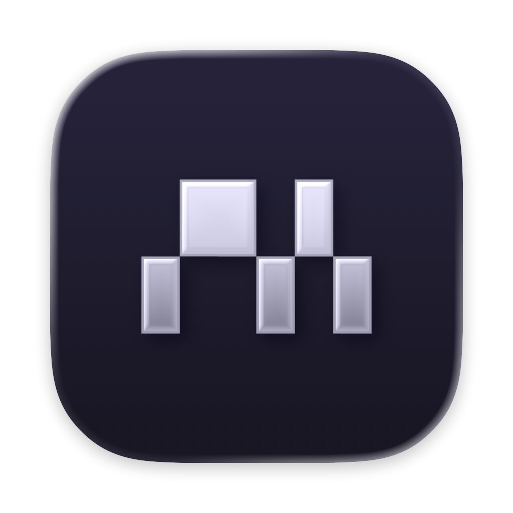

<h1 align="center">
  
  <br />
  ▞▚ macterm ▞▚
</h1>

<p align="center">
  A lightweight, native terminal for macOS built with SwiftUI and libghostty.
</p>


## Features

- **Vertical Project Sidebar**: Native macOS sidebar for organizing projects and tabs vertically.
- **Split Panes**: Unlimited horizontal and vertical splits, with optional auto-tiling.
- **Persistence**: Projects, tabs, and panes are saved and restored automatically.
- **Quick terminal**: Global terminal accessible from anywhere.
- **Highly Configurable**: Configurable theme, font, and keymap with hot-reloading.
- **Command Palette**: Versatile command palette to interact with multiplexing (open, delete, and search projects)

## Install

Download the latest `.dmg` from [Releases](https://github.com/thdxg/macterm/releases), open it, and drag Macterm to Applications.

Since the app isn't signed with an Apple Developer certificate, macOS will block it on first launch with a "*Macterm.app Not Opened*" dialog. Dismiss the dialog, then:

1. Open **System Settings → Privacy & Security**.
2. Scroll to the **Security** section — you'll see *"Macterm.app was blocked…"* with an **Open Anyway** button. Click it.
3. Launch Macterm again and confirm.

You only need to do this once. (Or, from Terminal: `xattr -cr /Applications/Macterm.app`, then launch normally.)

## Updates

Macterm ships with automatic updates via [Sparkle](https://sparkle-project.org/). A version check runs daily in the background and can be triggered manually from **Macterm → Check for Updates…** or in **Settings → Updates**. Updates are verified with an EdDSA signature baked into the app, so later versions install without any `xattr` workaround. No telemetry is collected.

## Requirements

- macOS 26.0+
- Swift 6.0+
- [mise](https://mise.jdx.dev/) (optional, but recommended)

## Quick Start

```bash
# Install necessary tools (swiftlint, gh, etc.)
mise install

# Setup dependencies
mise run setup

# Run in debug mode
mise run run

# Build release bundle
mise run build

# Run the test suite
mise run test
```

## Contributing

Run `mise run check:fix` before committing — it formats, lints, and runs the test suite. CI runs the same checks on every push and pull request.

## Releasing

Tag-pushed builds are released via `.github/workflows/release.yml`. The workflow needs these secrets configured on the repo:

- `GH_PAT` — PAT with `contents:read` on `thdxg/ghostty` (used to download GhosttyKit).
- `SPARKLE_ED_PUBLIC_KEY` — the EdDSA public key baked into `Info.plist`.
- `SPARKLE_ED_PRIVATE_KEY` — the matching private key, used to sign each release DMG.

Generate the keypair once by downloading Sparkle and running `./bin/generate_keys`. Store the public key in `SPARKLE_ED_PUBLIC_KEY` (it's not secret, but keeping it as a secret avoids committing it to the repo) and the private key in `SPARKLE_ED_PRIVATE_KEY`. Back the private key up in a password manager — losing it means users cannot auto-update to any further release.

The workflow pushes a new `<item>` to `appcast.xml` on the `gh-pages` branch, which GitHub Pages serves at `https://thdxg.github.io/macterm/appcast.xml` — the feed URL baked into `Info.plist`.

## License

MIT
