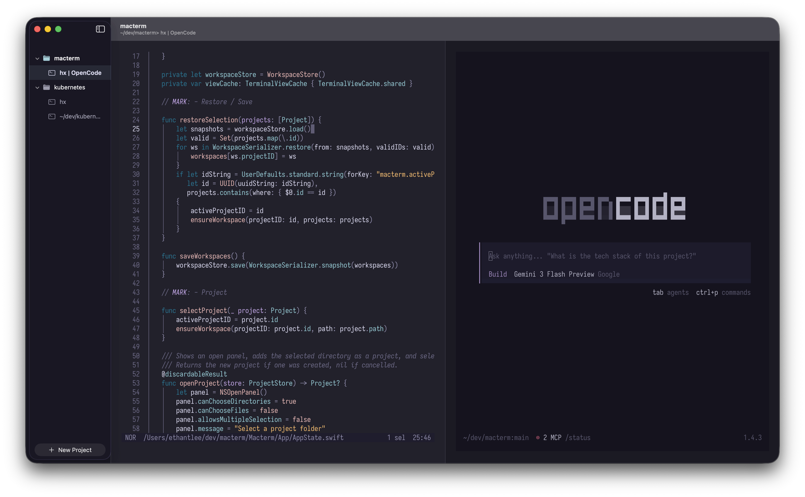

<h1 align="center">▞▚ macterm ▞▚</h1>

<p align="center">
  macterm is a modern terminal multiplexer for macOS, featuring a native sidebar for vertical project and tab management. Built with SwiftUI and powered by libghostty.
</p>



## Features

- **Vertical Project Sidebar**: Native macOS sidebar for organizing projects and tabs vertically.
- **Split Panes**: Unlimited horizontal and vertical splits.
- **Persistence**: Workspaces are saved and restored automatically.
- **Quick Terminal**: Global dropdown terminal accessible from anywhere.
- **Highly Configurable**: Custom hotkeys, themes, and more.

## Requirements

- macOS 14.0+
- Swift 6.0+
- [mise](https://mise.jdx.dev/) (optional, but recommended)

## Quick Start

```bash
# Setup dependencies
mise run setup

# Run in debug mode
mise run run

# Build release bundle
mise run build
```

## License

MIT
