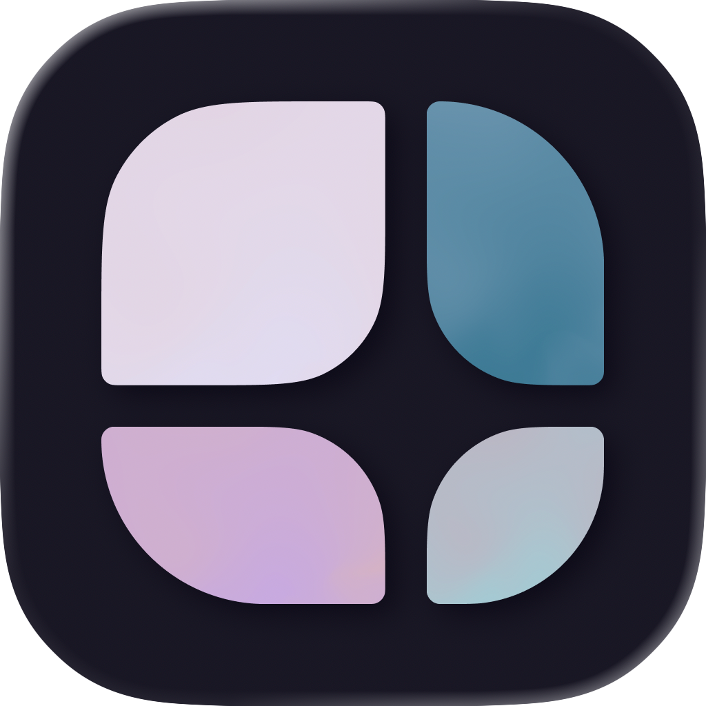
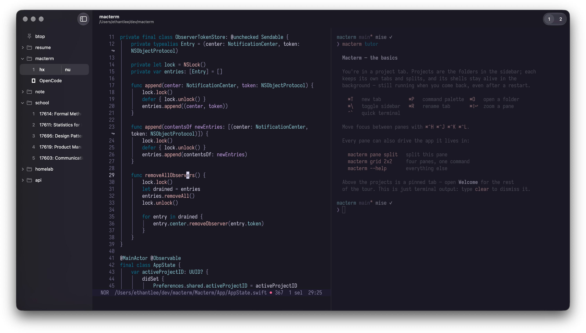

<h1 align="center">
  
  <br />
  Macterm
</h1>

<p align="center">
  A lightweight macOS terminal with vertical tabs, session persistence, and native UI. Built on libghostty.
</p>

<p align="center">
  <a href="https://github.com/thdxg/macterm/releases/latest">
    
  </a>
  <a href="https://github.com/thdxg/macterm/releases">
    
  </a>
  <a href="https://github.com/thdxg/macterm/actions/workflows/checks.yml">
    
  </a>
  
</p>

<p align="center">
  <a href="https://macterm.thdxg.dev"><b>Website</b></a> ·
  <a href="https://macterm.thdxg.dev/docs"><b>Docs</b></a> ·
  <a href="https://github.com/thdxg/macterm/releases"><b>Releases</b></a>
</p>



<p align="center">
  <a href="https://macterm.thdxg.dev/#features"><b>Watch it work →</b></a>
</p>

> [!NOTE]
> This project is unrelated to [MacTerm](https://github.com/kmgrant/macterm), a pre-existing macOS terminal emulator that shares the name.

## Features

- **Session persistence** \
  Quitting detaches your shells instead of killing them; relaunching brings them back with scrollback and running processes intact.
- **Multiplexing** \
  Drag a pane onto another to join them, or separate one into its own tab — by drag or by keybind. Projects, tabs, and split layouts are saved and restored on relaunch.
- **Remote projects** \
  Open a directory on another machine over SSH. Your shells keep running there, surviving quits, dropped connections, and even a local reboot.
- **Vertical project sidebar** \
  Organize projects and their tabs in a native macOS sidebar, stacked vertically where there's room to read them. Right-click any folder in Finder → Services → **New Macterm Project Here** to add one without leaving Finder.
- **Pinned tabs** \
  Pin a tab above your projects to keep it running: it starts on every launch, and restores itself with its command if the session dies.
- **Command palette** \
  Press <kbd>⌘P</kbd> to split panes, switch projects, or open a directory. Every action is a keystroke away, and each row shows its keybind.
- **Declarative layouts** \
  Describe a project's tabs, splits, and per-pane commands in YAML; Macterm builds the workspace from it on open.
- **Control CLI** \
  A bundled `macterm` command drives the running app, so scripts and AI agents can spawn panes, run commands, and script layouts.
- **Quick terminal** \
  A global drop-down terminal on a hotkey (<kbd>⌃`</kbd>), for scratch work from anywhere.
- **Adaptive background** \
  The window picks up the background color the running program paints. A full-screen TUI tints the whole window to match; in a split, each pane takes its own.
- **Ghostty compatibility** \
  Reads your existing Ghostty config. Theme, font, keybinds: all of it just works.

## Install

### Homebrew

```bash
brew install --cask thdxg/tap/macterm
```

The cask strips the Gatekeeper quarantine attribute on install, so the app launches without extra prompts.

### From Releases

Download the latest `.dmg` from [Releases](https://github.com/thdxg/macterm/releases), open it, and drag Macterm to Applications. Since the app isn't signed with an Apple Developer certificate, clear the quarantine flag once:

```bash
xattr -cr /Applications/Macterm.app
```

Sparkle handles updates from there, verifying an EdDSA signature on each one — so you won't need `xattr` again.

## Configuration

Macterm reads your Ghostty config from the same locations Ghostty does (`~/.config/ghostty/config` or `~/Library/Application Support/com.mitchellh.ghostty/config`), so an existing setup carries over unchanged. Every key is documented in the [Ghostty option reference](https://ghostty.org/docs/config/reference). A minimal config looks like this:

```ini
theme = catppuccin-mocha
font-family = JetBrains Mono
font-size = 14
```

Macterm's own settings — window opacity, sidebar behavior, quick-terminal size, keymaps — live in **Macterm → Settings**. See the [configuration docs](https://macterm.thdxg.dev/docs/configuration) for the full precedence order and the few chrome keys Macterm overrides.

## Cookbook

Workflows and recipes from the community — the layouts, keybinds, and scripts people actually run to get more out of Macterm. Three to start with: [one <kbd>⌃hjkl</kbd> chord that moves between nvim's splits *and* Macterm's panes](https://github.com/thdxg/macterm/discussions/217), [driving an interactive program from a script](https://github.com/thdxg/macterm/discussions/218), and [giving a coding agent control of Macterm](https://github.com/thdxg/macterm/discussions/219).

Got a recipe of your own? [Start a Cookbook topic](https://github.com/thdxg/macterm/discussions/new?category=cookbook) — anyone can post, and anyone can borrow.

## Contributing

See [CONTRIBUTING.md](CONTRIBUTING.md) for setup, build, and PR guidelines.

## License

MIT
