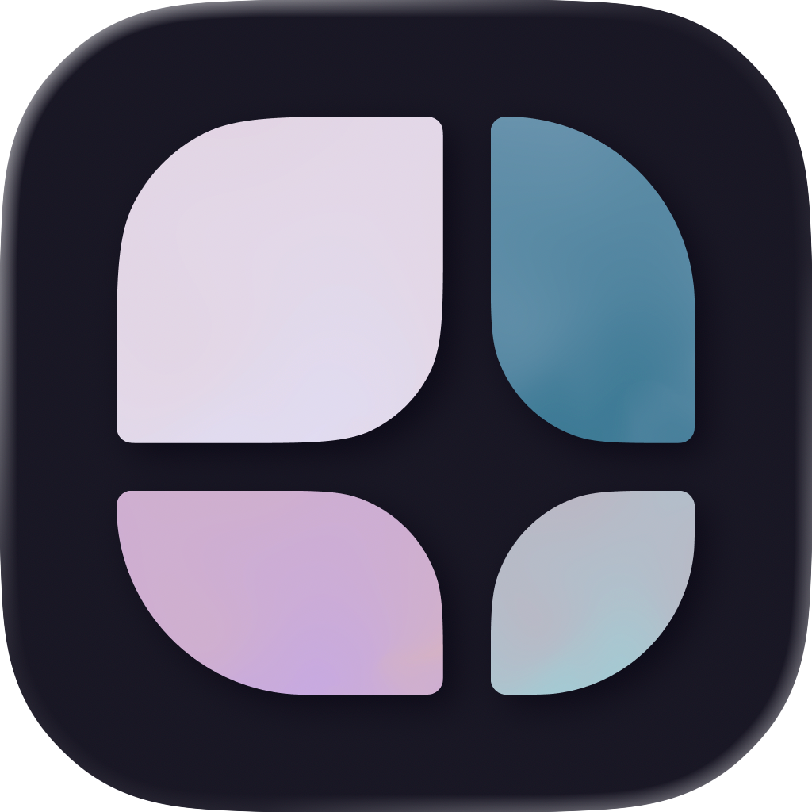
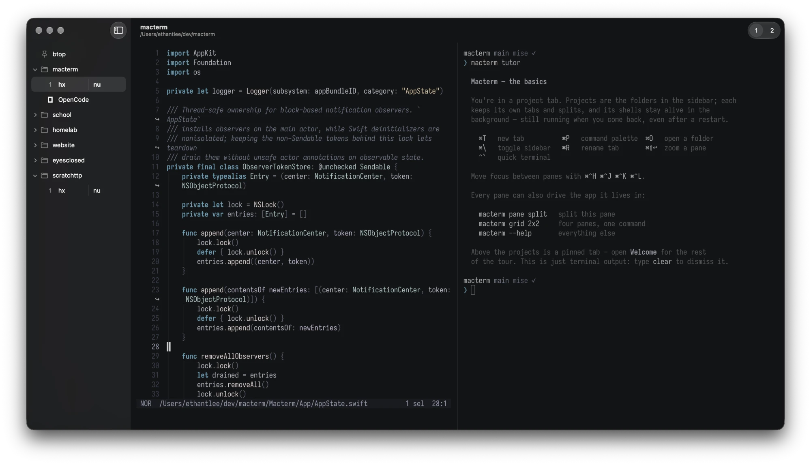

<h1 align="center">
  
  <br />
  Macterm
</h1>

<p align="center">
  A lightweight macOS terminal with vertical tabs, persistent sessions and a native interface. Built on libghostty.
</p>

<p align="center">
  <a href="https://github.com/thdxg/macterm/releases/latest">
    
  </a>
  <a href="https://github.com/thdxg/macterm/releases">
    
  </a>
  <a href="https://github.com/thdxg/macterm/actions/workflows/checks.yml">
    
  </a>
  
</p>

<p align="center">
  <a href="https://macterm.thdxg.dev"><b>Website</b></a> ·
  <a href="https://macterm.thdxg.dev/docs"><b>Docs</b></a> ·
  <a href="https://github.com/thdxg/macterm/releases"><b>Releases</b></a>
</p>



<p align="center">
  <a href="https://macterm.thdxg.dev/#features"><b>Watch it work →</b></a>
</p>

> [!NOTE]
> This project has no relation to [MacTerm](https://github.com/kmgrant/macterm), an earlier macOS terminal emulator with the same name.

## Features

- **Session persistence** \
  When you quit, your shells keep running. When you start Macterm again, every pane returns with its scrollback and its running programs.
- **Multiplexing** \
  Drag a pane onto another pane to join them. Move a pane to its own tab with a drag or a keybind. Macterm saves your projects, tabs and splits and restores them when you start it again.
- **Remote projects** \
  Open a folder on another machine over SSH. Your shells keep running on that machine. They keep running when you quit Macterm, when the connection drops and when you restart your Mac.
- **Vertical project sidebar** \
  Projects and their tabs are in a native macOS sidebar. The sidebar is vertical, so there is room to read long names. To add a project from Finder, right-click a folder and select **Services → New Macterm Project Here**.
- **Pinned tabs** \
  Pin a tab above your projects to keep it. It starts each time Macterm starts. If its session ends, Macterm starts it again with its command.
- **Command palette** \
  Press <kbd>⌘P</kbd> to split panes, switch projects or open a folder. Each command is in the palette, and each row shows its keybind.
- **Declarative layouts** \
  Write the tabs, splits and commands of a project in YAML. Macterm builds the tabs from the file when you apply the layout.
- **Control CLI** \
  The bundled `macterm` command controls the running app. Scripts and AI agents can open panes, run commands, and apply and save layouts. `macterm skills` prints skills that teach a coding agent to use the CLI.
- **Quick terminal** \
  A drop-down terminal with a global keybind (<kbd>⌃`</kbd>). Use it for short tasks from any app.
- **Desktop widgets** \
  Put a terminal on your desktop next to the macOS widgets. It has the same grid and the same shape. Its shell keeps running when you quit. The widget returns to the same place.
- **Password autofill** \
  When `ssh`, `sudo` or another program asks for a password, Macterm offers to save the password in your keychain after the password works. The next time the same prompt appears, Macterm fills it in after Touch ID or your login password.
- **Adaptive background** \
  The window takes the background color that the running program paints. A full-screen program colors the whole window. In a split, each pane takes its own color.
- **Ghostty compatibility** \
  Macterm reads your existing Ghostty config. Your theme, font and keybinds carry over.

## Install

### Homebrew

```bash
brew install --cask thdxg/tap/macterm
```

The cask removes the Gatekeeper quarantine attribute when it installs. The app then starts with no extra prompts.

### From Releases

Download the latest `.dmg` from [Releases](https://github.com/thdxg/macterm/releases). Open it and drag Macterm to Applications. The app has no Apple Developer certificate signature, so clear the quarantine flag one time:

```bash
xattr -cr /Applications/Macterm.app
```

After that, Sparkle installs updates. It checks an EdDSA signature on each update. You do not need `xattr` again.

## Configuration

Macterm reads your Ghostty config from the same places as Ghostty: `~/.config/ghostty/config` or `~/Library/Application Support/com.mitchellh.ghostty/config`. An existing setup carries over with no change. The [Ghostty option reference](https://ghostty.org/docs/config/reference) documents every key. A minimal config looks like this:

```ini
theme = catppuccin-mocha
font-family = JetBrains Mono
font-size = 14
```

A few Macterm defaults are different from the Ghostty defaults: theme, font size, padding and `macos-option-as-alt`. Macterm also sets `tab-inherit-working-directory = false`, so new tabs open at the project root. Macterm loads these defaults before your config. A key that you set always wins. `defaultsBody` in [`MactermConfig.swift`](https://github.com/thdxg/macterm/blob/main/Macterm/Config/MactermConfig.swift) has the full list.

Macterm has its own settings for window opacity, sidebar behavior, quick terminal size and keymaps. Open them with **Macterm → Settings**. The [configuration docs](https://macterm.thdxg.dev/docs/configuration) give the full order of precedence and the few window keys that Macterm overrides.

## Cookbook

The community shares workflows and recipes: layouts, keybinds and scripts that people run with Macterm. For example:
- [Use one set of <kbd>⌃hjkl</kbd> keybinds to move between Neovim splits and Macterm panes](https://github.com/thdxg/macterm/discussions/217)
- [Drive an interactive program from a script](https://github.com/thdxg/macterm/discussions/218)
- [Give a coding agent control of Macterm](https://github.com/thdxg/macterm/discussions/219)
- [A Neovim plugin that moves focus between Neovim splits and Macterm panes with the same directional keybinds](https://github.com/thdxg/macterm/discussions/459)

Do you have a recipe? [Start a Cookbook topic](https://github.com/thdxg/macterm/discussions/new?category=cookbook). Anyone can post a recipe, and anyone can use one.

## Contributing

Read [CONTRIBUTING.md](CONTRIBUTING.md) for setup, build and pull request rules.

## License

MIT
